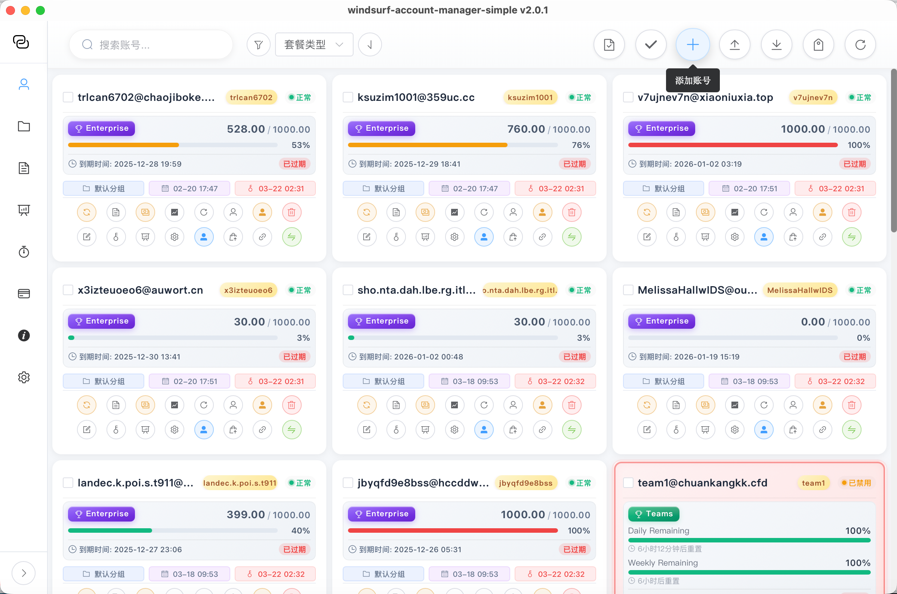
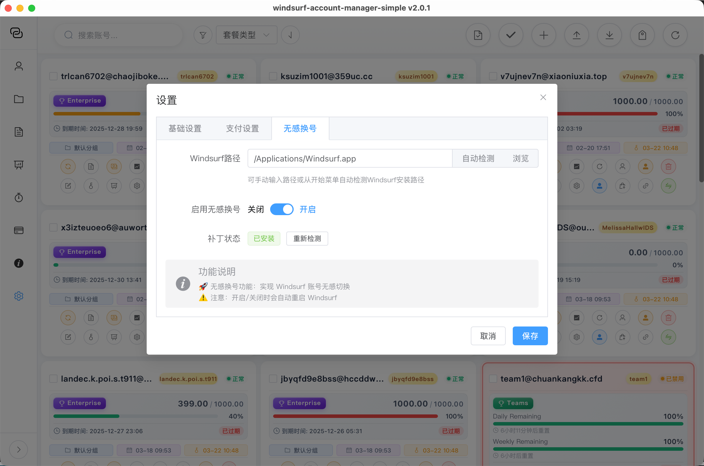

<div align="center">


<br/><br/>


<br/><br/>

**Windsurf 多账号管理 & 无感切号 桌面应用**

*基于 Tauri + Vue3 + Rust 构建 | 高性能 | 全平台 | 开箱即用*

<br/>

[`下载最新版本`](https://github.com/1837620622/windsurf-account-manager-releases/releases)

</div>

<br/>


## 界面预览

<div align="center">

<br/>
<sub>主界面 — 多账号卡片式管理，配额 / 套餐 / 状态一目了然</sub>
</div>


## 核心功能

```
┌─────────────────────────────────────────────────────────────────┐
│  SEAMLESS SWITCH    配额耗尽 → 自动切换下一个账号 → 零操作      │
│  ELASTIC BILLING    实时 Daily / Weekly 配额剩余百分比监控      │
│  BATCH MANAGEMENT   批量导入 / 刷新 / 登录 / 导出              │
│  TEAM CONTROL       团队成员管理 / 席位调整 / 积分重置          │
│  PRIVACY MODE       一键隐藏邮箱地址                            │
│  MULTI-PLATFORM     Windows / macOS / Linux × x64 / ARM64      │
└─────────────────────────────────────────────────────────────────┘
```


## 快速上手

> **操作流程：开启无感切号 → 导入账号 → 自动切换，全程 3 步**

<br/>

### `STEP 01` — 开启无感切号

安装并打开软件后，点击左下角 **设置** → 切换到 **无感切号** 选项卡

<div align="center">

</div>

```
1. 确认 Windsurf 路径已自动检测（或手动浏览选择）
2. 将「启用无感切号」开关切为【开启】
3. 点击【保存】
```

> 开启后，当前账号配额耗尽时自动切换到下一个可用账号，并自动重启 Windsurf

<br/>

### `STEP 02` — 导入账号

点击顶部 **添加账号** 或 **批量导入** 按钮

**单个添加** — 输入邮箱和密码，点击确定

**批量导入（推荐）** — 每行一个账号，格式如下：

```
user1@example.com password123 主力号
user2@example.com password456 备用号
user3@example.com password789
```

> 勾选「导入后自动登录」，自动获取所有账号的套餐和配额信息

<br/>

### `STEP 03` — 开始使用

```
账号导入成功后：
  → 每张卡片显示套餐类型 / 配额用量 / 到期时间
  → 配额用尽 → 自动切换下一个账号 → Windsurf 自动重启
  → 无缝继续工作，全程无需手动干预
```


## 下载安装

前往 [`Releases`](https://github.com/1837620622/windsurf-account-manager-releases/releases) 下载最新版本

### Windows

| 文件类型 | 适用架构 | 说明 |
|:--------:|:--------:|:-----|
| `*_x64-setup.exe` | x64 (Intel/AMD) | NSIS 安装程序，适用于大多数 Windows 电脑 |
| `*_arm64-setup.exe` | ARM64 | 适用于搭载高通骁龙芯片的 Windows 笔记本 |
| `*_x64_zh-CN.msi` | x64 | MSI 安装包（企业部署推荐） |
| `*_arm64_zh-CN.msi` | ARM64 | MSI 安装包 ARM64 版本 |

> 不确定架构？打开 **设置 → 系统 → 关于**，查看「系统类型」

### macOS

| 文件类型 | 适用架构 | 说明 |
|:--------:|:--------:|:-----|
| `*_aarch64.dmg` | Apple Silicon (M1/M2/M3/M4) | 适用于 2020 年后的 Mac（推荐） |
| `*_x64.dmg` | Intel | 适用于 2020 年前的 Intel Mac |

> 不确定架构？点击左上角苹果图标 → **关于本机**，查看芯片信息

#### macOS 首次打开提示「已损坏」的解决方法

macOS 对未签名应用会拦截，按以下步骤操作：

```bash
# 第一步：移除隔离属性
sudo xattr -rd com.apple.quarantine /Applications/windsurf-account-manager.app

# 第二步：直接运行（首次需要通过终端启动一次）
sudo /Applications/windsurf-account-manager.app/Contents/MacOS/windsurf-account-manager
```

> 执行后会弹出应用窗口，之后即可正常从启动台打开，无需再执行命令

### Linux

| 文件类型 | 适用架构 | 说明 |
|:--------:|:--------:|:-----|
| `*_amd64.deb` | x64 | Debian / Ubuntu |
| `*_arm64.deb` | ARM64 | Debian / Ubuntu ARM 版 |
| `*_x86_64.rpm` | x64 | Fedora / CentOS / RHEL |
| `*_aarch64.rpm` | ARM64 | Fedora ARM 版 |
| `*_amd64.AppImage` | x64 | 免安装通用格式 |

```bash
# deb 安装
sudo dpkg -i windsurf-account-manager_*.deb

# rpm 安装
sudo rpm -i windsurf-account-manager-*.rpm

# AppImage 运行
chmod +x windsurf-account-manager_*.AppImage
./windsurf-account-manager_*.AppImage
```


## 技术栈

```
Frontend    Vue 3 + TypeScript + Element Plus + Pinia
Backend     Rust (Tauri 2.x)
Build       Vite + Cargo
Platform    Windows / macOS / Linux (x64 + ARM64)
```


## 联系作者

```
微信        1837620622（传康Kk）
邮箱        2040168455@qq.com
咸鱼/B站    万能程序员
```


<div align="center">
<sub>本工具仅供学习研究使用，请遵守 Windsurf 服务条款。使用本工具产生的任何后果由使用者自行承担。</sub>
</div>
