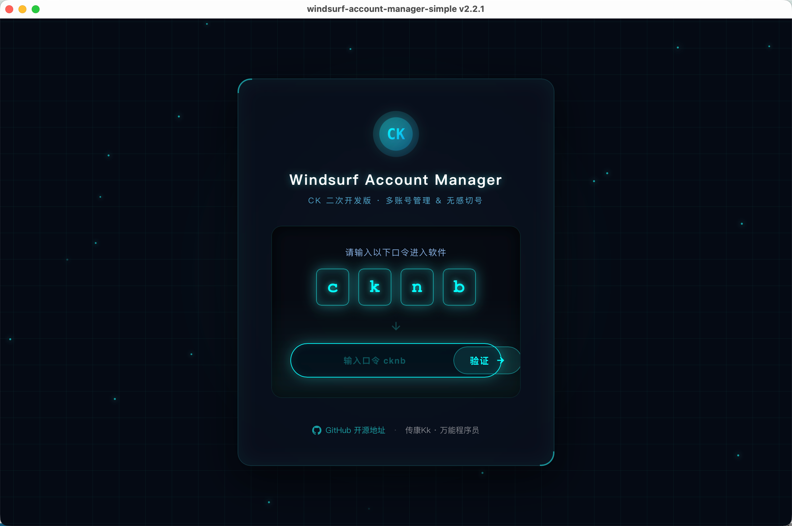
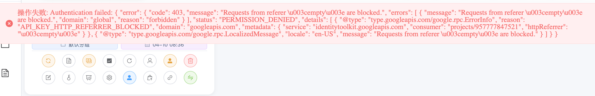

# Windsurf Account Manager (CK 二次开发版)



## 最新动态

> **截止 2026 年 4 月 10 日，切号功能一切正常。**

近期听闻社区反馈：部分新注册账号在其他工具中出现无法切号的情况。经本人实测，在本切号软件（Windsurf Account Manager CK 二次开发版）中，**新注册账号的切号功能完全正常**，不受该问题影响。如遇类似问题，欢迎使用本工具进行切换。

### v2.2.1 更新内容

近期社区反馈的 Firebase Referer 403 错误（如下图），已在本版本中彻底修复：



- **修复数据损坏**：修复账号多时 JSON 数据损坏（trailing characters）导致启动失败的问题
- **并发写入保护**：添加写入互斥锁，防止多任务并发写入文件导致数据竞态
- **智能数据恢复**：增强数据文件损坏时的自动修复能力（智能截断 + 备份恢复）
- **修复更新检测**：修复自动更新检测功能中版本号解析错误的问题
- **门户页重构**：赛博科技风格 UI + 修复 6 项前端问题
- **全平台兼容**：macOS / Windows / Linux 全平台测试通过

## 使用说明

> 启动软件后，会显示欢迎门户页面。请在输入框中输入访问口令 **`cknb`**，然后点击「验证」按钮即可进入主界面。

基于 Tauri + Vue 3 + TypeScript 的 Windsurf 多账号管理桌面应用，支持弹性计费（Elastic Billing）模式下的配额实时监控、批量Token刷新、一键换号等功能。

> 本项目由 **传康Kk** 基于原版进行二次开发，适配 Windsurf 2026 弹性计费新模型，新增每日/每周配额可视化、重置倒计时等特性。

## 功能特性

| 模块 | 功能说明 |
|---|---|
| 账号管理 | 添加/编辑/删除账号、分组、标签、加密存储（AES-256-GCM） |
| 弹性计费监控 | 每日/每周配额剩余百分比、进度条可视化、重置倒计时 |
| Token 管理 | 自动刷新、批量刷新（最多5并发）、过期提醒 |
| 一键换号 | OAuth 回调自动登录、windsurf:// 协议触发 |
| 团队管理 | 查看/邀请/移除成员、团队积分统一管理 |
| 账单查询 | 套餐信息、使用量统计、订阅状态、积分详情 |
| 数据安全 | 系统密钥链存储加密密钥、所有数据仅本地存储 |

## 弹性计费适配（v2.0 新增）

Windsurf 于 2026 年从积分制切换为弹性计费模型（Usage Allowance），本项目已完成全链路适配：

- **后端**：Protobuf 解析器新增 `daily_quota_remaining_percent`、`weekly_quota_remaining_percent`、`daily_quota_reset_timestamp`、`weekly_quota_reset_timestamp` 字段提取
- **数据模型**：Account 结构体扩展弹性计费字段
- **前端卡片**：AccountCard 新增每日/每周配额进度条和重置倒计时
- **详情弹窗**：AccountInfoDialog 新增弹性计费配额可视化面板

## 技术栈

| 层级 | 技术 |
|---|---|
| 前端框架 | Vue 3 + TypeScript |
| UI 组件库 | Element Plus |
| 状态管理 | Pinia |
| 构建工具 | Vite |
| 后端框架 | Tauri 2.x (Rust) |
| 加密方案 | AES-256-GCM + 系统密钥链 |
| 网络请求 | Reqwest + Tokio |
| API协议 | Protobuf (gRPC-Web) + Firebase Auth |

## 安装和运行

### 前提条件

- Node.js 16+
- Rust 1.70+
- macOS / Windows / Linux

### Mac 部署步骤

```bash
git clone https://github.com/1837620622/windsurf-account-manager.git
cd windsurf-account-manager
npm install
npm run tauri dev
```

构建发布版：

```bash
npm run tauri build
```

构建产物位于 `src-tauri/target/release/bundle/`（`.dmg` 安装包）。

### Windows 部署步骤

```bash
git clone https://github.com/1837620622/windsurf-account-manager.git
cd windsurf-account-manager
npm install
npm run tauri dev
```

构建发布版：

```bash
npm run tauri build
```

构建产物位于 `src-tauri/target/release/bundle/`（`.msi` 或 `.exe` 安装包）。

### Linux 部署步骤

```bash
git clone https://github.com/1837620622/windsurf-account-manager.git
cd windsurf-account-manager
npm install
npm run tauri dev
```

构建产物位于 `src-tauri/target/release/bundle/`（`.deb` / `.AppImage`）。

## 项目结构

```
windsurf-account-manager/
├── src/                      # Vue 前端源码
│   ├── components/           # 组件（AccountCard、AccountInfoDialog 等）
│   ├── store/modules/        # Pinia 状态管理
│   ├── api/                  # Tauri 命令调用封装
│   ├── types/                # TypeScript 类型定义
│   └── utils/                # 工具函数
├── src-tauri/                # Rust 后端源码
│   ├── src/models/           # 数据模型（Account 等）
│   ├── src/services/         # 业务逻辑（proto_parser、windsurf_service）
│   ├── src/commands/         # Tauri 命令（api_commands 等）
│   └── Cargo.toml            # Rust 依赖
├── package.json
└── vite.config.ts
```

## 数据存储

| 系统 | 路径 |
|---|---|
| macOS | `~/Library/Application Support/com.chao.windsurf-account-manager/accounts.json` |
| Windows | `%APPDATA%\com.chao.windsurf-account-manager\accounts.json` |
| Linux | `~/.config/com.chao.windsurf-account-manager/accounts.json` |

所有敏感信息（密码、Token）均使用 AES-256-GCM 加密，密钥存储在系统密钥链中。

## 常见问题

**Token 刷新失败**：检查账号密码是否正确、网络是否通畅、Token 是否已过期（尝试重新登录）。

**配额显示为空**：需先刷新 Token 以触发 GetPlanStatus API 调用获取最新配额数据。

**如何备份数据**：将上述路径的 `accounts.json` 文件复制到安全位置即可。

## 二次开发信息

- **二次开发者**：传康Kk
- **微信**：1837620622
- **邮箱**：2040168455@qq.com
- **咸鱼/B站**：万能程序员
- **开源地址**：https://github.com/1837620622/windsurf-account-manager

## 许可证

MIT License

## 免责声明

本工具仅供学习和个人使用，请遵守 Windsurf 服务条款。作者不对因使用本工具产生的任何问题负责。
